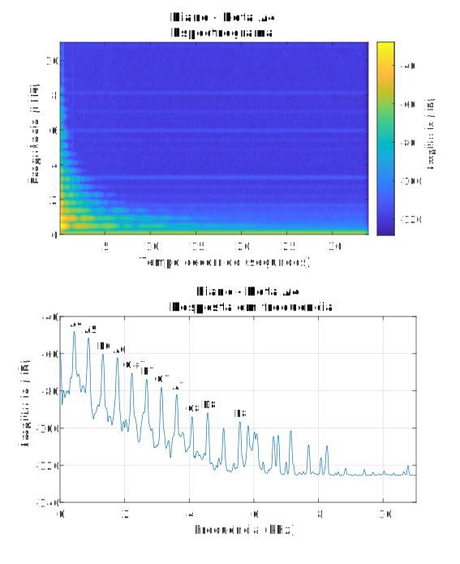
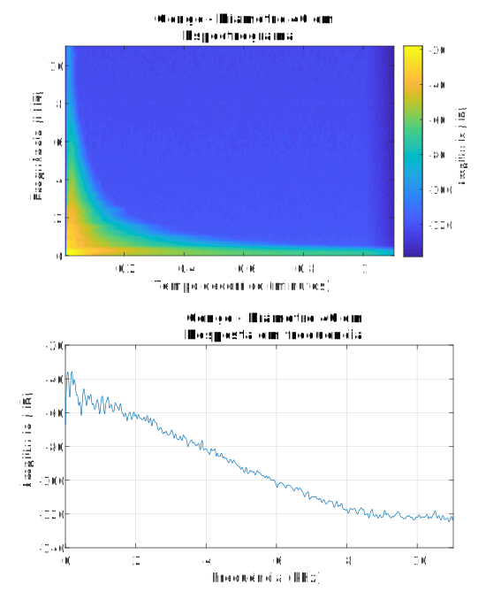

# 2.1 Notas

Uma nota musical apenas, do ponto de vista científico e artístico, encerra nela própria tantos assuntos diferentes que, fazendo apenas uma análise das suas características intrínsecas, daria material suficiente para escrever vários livros. Com o objetivo de tornar do leitor um músico mais versado, apresenta-se, do ponto de vista científico, qual a natureza de uma nota musical, nomeadamente o seu conteúdo harmónico.

Embora o tema dos harmónicos, do ponto de vista físico, musical e sensorial, seja complexo e simultaneamente entusiasmante, é objetivo deste capítulo proporcionar uma visão geral do mesmo, sem ser demasiado teórico, mas claro o suficiente para que o leitor possa ter uma visão mais alargada sobre o tema. É objetivo apresentar ao músico, do ponto de vista físico, quais as características acústicas das notas produzidas por instrumentos musicais, para que este as possa usar em seu benefício aquando a sua própria abordagem relativamente à música.

Como visto anteriormente, o timbre, do ponto de vista musical, é o atributo que nos permite distinguir as características, ou as assinaturas acústicas dos vários instrumentos. É o que nos permite distinguir a mesma nota tocada por uma flauta ou por um saxofone. Do ponto de vista físico, o timbre é um sinal acústico complexo, formado pela sobreposição simultânea de várias ondas sonoras mais simples, com diferentes frequências e amplitudes, que no seu conjunto, conferem uma assinatura única e característica de um determinado instrumento ou nota musical. Esta assinatura acústica é também afetada pelo próprio músico, dependo do ataque, da intensidade, ou do modo com que aborda fisicamente o instrumento. Diferentes músicos, com diferentes técnicas e diferentes sensibilidades, irão obter do mesmo instrumento diferentes sonoridades.

Como o sinal acústico de uma nota musical é um sinal complexo, quando um pianista toca a nota \[A] na 4.ª oitava (A4), o sinal acústico que ouve não contém apenas a frequência fundamental do A4 (f0 = 440 Hz). Se assim fosse, o som soaria essencialmente a um apito. Existe um conjunto mais vasto de outras frequências com diferentes intensidades que fazem com que a nota A4 tocada num piano seja reconhecida, pelos seres humanos, como um A4 tocado efetivamente num piano, e não noutro instrumento.

Do ponto de vista prático, talvez a ferramenta científica mais adequada para se analisar a assinatura acústica de uma nota tocada num instrumento musical, seja a transformada discreta de Fourier, ou «DFT Discrete Fourier Transform». O objetivo desta transformação é passar a informação que existe no domínio do tempo para informação no domínio da frequência, o que permite analisar a componente harmónica existente numa nota musical. Em inglês este conteúdo harmónico é denominado de «Harmonic Series» ou «Overtone Series».

Considerem-se os quatro gráficos seguintes, que apresentam nos domínios do tempo e da frequência, as várias frequências e amplitudes que compõem a nota A4 tocada num piano e o som produzido por um gongo.

<figure><figcaption>
Figura 2.1. Espetrograma e resposta em frequência da nota A4 num piano acústico.
</figcaption></figure>

<figure><figcaption>
Figura 2.2. Espetrograma e resposta em frequência de um gongo de diâmetro 40 cm.
</figcaption></figure>

A figura acima apresenta, primeiro, a resposta espetral de uma nota A4 tocada num piano acústico, e em segundo lugar, a resposta espetral do som produzido por um gongo com diâmetro de 40 cm. O objetivo da resposta espetral é analisar os sinais acústicos produzidos por ambos os instrumentos nos domínios do tempo-frequência e da frequência.

Em particular, nos dois gráficos do topo, são consideradas simultaneamente três variáveis:

1. O eixo horizontal representa o tempo decorrido (em minutos ou segundos).
2. O eixo vertical representa as várias frequências que foram obtidas através da decomposição da série harmónica do sinal acústico produzido pelos instrumentos (em Hz).
3. O gradiente de cor, do mais claro para o mais escuro, representa a intensidade, ou amplitude, de cada uma dessas frequências que se encontram presentes na nota (em dB).

Relativamente à análise do sinal acústico da nota A4 no piano, apresentada no canto superior esquerdo, verifica-se que as frequências mais baixas perduram mais no tempo e são mais intensas, ou seja, a sua cor é mais clara, e à medida que as frequências vão aumentado no eixo vertical, é possível verificar que estas perduram cada vez menos tempo e são cada vez menos intensas, até se extinguirem por completo.

Para ser possível estudar melhor o comportamento da série harmónica produzida por este instrumento, retiramos a variável tempo decorrido, e, no canto inferior esquerdo, é apresentado o respetivo gráfico cujo eixo horizontal passa a ter o conjunto de frequências analisadas e no eixo vertical a amplitude em dB de cada uma dessas frequências.

É possível ver, claramente, a existência de picos em determinadas frequências. Se fizermos corresponder, a cada uma dessas frequências, as frequências predeterminadas das notas musicais, podemos ver que o A4 a 440 Hz é efetivamente a frequência mais forte (f0 = frequência fundamental), mas existem outras notas, de intensidade inferior, mas relevantes, presentes nesta nota. As notas que se encontram no A4, ou seja, \[A4, A5, E6, A6, C#7, E7, G7] são efetivamente intervalos relativos a A4 maioritariamente consoantes. Verifica-se: A5 (8.ª perfeita), E6 (5.ª perfeita), A6 (8.ª perfeita), C#7 (3.ª maior), E7 (5.ª perfeita), G7 (7.ª menor). O conceito relativo a intervalo será apresentado em breve.

Sublinha-se o fato de que em todos os gráficos a amplitude é apresentada em dB (decibel). Esta é uma escala logarítmica e um decréscimo de 20 dB representa um decréscimo de 1/100 em unidades lineares. Considerando que o ouvido humano ouve as amplitudes de quaisquer frequências do mesmo modo, o que também não é inteiramente correto pois o ouvido humano é mais sensível a certas frequências, a diferença de amplitudes entre a frequência da nota E6 (-60 dB) e a nota G7 (quase -80 dB) é de 1/100, ou seja, a nota G7 será percebida como tendo um volume aproximadamente cem vezes inferior que a E6.

Como visto anteriormente, o piano é um instrumento musical que produz sons de altura definida, ou seja, é possível produzir, de forma inequívoca, notas específicas com este instrumento, sendo que como já visto, em cada uma dessas notas existem outras notas de menor intensidade, em diferentes frequências, que caracterizam a assinatura acústica de um piano. Outras frequências, com outras combinações de amplitudes, irão conferir outra assinatura à nota A4, e esse timbre irá ser associado a um outro instrumento musical.

Em contraste com os instrumentos musicais de altura definida, os de altura indefinida, como por exemplo a maior parte dos de percussão, não produzem nenhuma nota musical em particular.
&#x20;O lado direito da figura apresentada anteriormente, esta apresenta a decomposição da série harmónica relativamente a um gongo, também denominado tantã, com um diâmetro de 40 centímetros.

Relativamente a este instrumento, é possível verificar que não existem picos e, consequentemente, não existem frequências específicas cujas amplitudes sejam predominantes relativamente às restantes. Desse modo, verificamos graficamente que este instrumento não produz nem notas definidas nem outras notas que estejam relacionadas entre si. No entanto, é efetivamente esta assinatura em termos de frequência que confere o som característico do gongo, necessário para completar a palete de sonoridades disponível para a arte da música.
